<svg xmlns="http://www.w3.org/2000/svg" viewBox="0 0 800 400" width="100%" height="100%">
  <defs>
    <filter id="glowMagenta" x="-150%" y="-150%" width="400%" height="400%">
      <feGaussianBlur stdDeviation="15" result="blur" />
      <feMerge>
        <feMergeNode in="blur" />
        <feMergeNode in="blur" />
        <feMergeNode in="SourceGraphic" />
      </feMerge>
    </filter>
    
    <filter id="glowCyan" x="-150%" y="-150%" width="400%" height="400%">
      <feGaussianBlur stdDeviation="20" result="blur" />
      <feMerge>
        <feMergeNode in="blur" />
        <feMergeNode in="SourceGraphic" />
      </feMerge>
    </filter>

    <filter id="glowBlue" x="-150%" y="-150%" width="400%" height="400%">
      <feGaussianBlur stdDeviation="20" result="blur" />
      <feMerge>
        <feMergeNode in="blur" />
        <feMergeNode in="SourceGraphic" />
      </feMerge>
    </filter>

    <radialGradient id="gradBg" cx="50%" cy="50%" r="80%">
      <stop offset="0%" stop-color="#0f172a" /> <stop offset="100%" stop-color="#020617" /> </radialGradient>

    <linearGradient id="tsGrad" x1="0%" y1="0%" x2="100%" y2="100%">
      <stop offset="0%" stop-color="#3178C6" />
      <stop offset="100%" stop-color="#1D4ED8" />
    </linearGradient>

    <pattern id="dotGrid" x="0" y="0" width="30" height="30" patternUnits="userSpaceOnUse">
      <circle cx="15" cy="15" r="1" fill="#475569" opacity="0.3" />
    </pattern>
    
    
  </defs>

  <rect width="800" height="400" fill="url(#gradBg)" />
  
  <g class="bg-pan">
    <rect width="900" height="500" x="-50" y="-50" fill="url(#dotGrid)" />
    <circle cx="200" cy="80" r="40" fill="#3178C6" opacity="0.1" filter="url(#glowBlue)" />
    <circle cx="600" cy="300" r="60" fill="#d946ef" opacity="0.05" filter="url(#glowMagenta)" />
    <circle cx="400" cy="200" r="90" fill="#00ffff" opacity="0.03" filter="url(#glowCyan)" />
  </g>

  <path d="M 250 180 Q 400 20 550 180" fill="none" stroke="#ffffff" stroke-width="4" class="data-trail-anim" />

  <g class="next-bump">
    <ellipse cx="150" cy="180" rx="90" ry="45" fill="#ffffff" filter="url(#glowCyan)" opacity="0" class="impact-flash-cyan"/>
    <text x="150" y="195" fill="#ffffff" font-size="60" font-weight="900" text-anchor="middle" letter-spacing="-2">Next<tspan font-size="35" fill="#94a3b8">.js</tspan></text>
    <path d="M 235 125 Q 245 125 245 115 Q 245 125 255 125 Q 245 125 245 135 Q 245 125 235 125" fill="#00ffff" filter="url(#glowCyan)"/>
  </g>

  <g class="ts-bump">
    <ellipse cx="650" cy="180" rx="60" ry="60" fill="#3178C6" filter="url(#glowBlue)" opacity="0" class="impact-flash-blue"/>
    <path d="M 600 115 L 700 115 L 685 225 L 650 245 L 615 225 Z" fill="url(#tsGrad)" filter="url(#glowBlue)"/>
    <text x="650" y="195" fill="#ffffff" font-size="50" font-weight="bold" text-anchor="middle">TS</text>
  </g>

  <g class="ball-anim">
    <circle cx="0" cy="0" r="32" fill="#d946ef" filter="url(#glowMagenta)" />
    
    <text x="0" y="11" fill="#ffffff" font-size="32" text-anchor="middle" font-weight="900">IA</text>
    
    <circle cx="-25" cy="8" r="4" fill="#ffffff" opacity="0.8" filter="url(#glowMagenta)"/>
    <circle cx="-38" cy="-4" r="2.5" fill="#ffffff" opacity="0.5" filter="url(#glowMagenta)"/>
  </g>

  <line x1="250" y1="340" x2="550" y2="340" stroke="#334155" stroke-width="1" />
  
  <text x="400" y="375" fill="#94a3b8" font-size="20" text-anchor="middle" letter-spacing="6">TS | NEXT | IA</text>
</svg>

# Franklin Rodriguez

  

**Full Stack Developer | Next.js, TypeScript & Node.js**

## About Me

Full Stack Developer focused on building modern web applications with Next.js, React, TypeScript, Node.js and PostgreSQL.

My main interests are backend development, scalable systems and creating software that solves real business problems. I enjoy working across the full development lifecycle, from designing user interfaces to building APIs and managing data.

Currently expanding my knowledge in NestJS, Docker, backend architecture and advanced Next.js patterns.

## Tech Stack

### Frontend
* Next.js
* React
* TypeScript

### Backend
* Node.js
* REST APIs
* JWT Authentication

### Database
* PostgreSQL
* Prisma ORM
* Supabase

### Tools
* Git
* GitHub
* Vercel
* Render

## Featured Projects

### Trux
A logistics platform focused on fleet auditing, operational management and real-time tracking.

### Riwlogic
Projects focused on algorithms, workflow optimization and process automation.

## Currently Learning
* NestJS
* Docker
* Backend Architecture
* Advanced Next.js Patterns
* Data Structures & Algorithms
* Full Stack Development
* Backend Engineering
* Software Architecture
* Artificial Intelligence Integration
* Scalable Web Applications

## Contact

Feel free to explore my repositories and connect with me on LinkedIn.
