# Franklin Rodriguez

### Full Stack Developer — Next.js · TypeScript · Node.js

 

## About Me

Full Stack Developer focused on building modern web applications with **Next.js, React, TypeScript, Node.js and PostgreSQL**.

My main interests are backend development, scalable systems, and creating software that solves real business problems. I enjoy working across the full development lifecycle — from designing user interfaces to building APIs and managing data.

Currently expanding my knowledge in **NestJS, Docker, backend architecture, and advanced Next.js patterns**.

 

## Tech Stack

<table>
<tr>
<td valign="top" width="25%">

**Frontend**

</td>
<td valign="top" width="25%">

**Backend**

</td>
<td valign="top" width="25%">

**Database**

</td>
<td valign="top" width="25%">

**Cloud & Tools**

</td>
</tr>
</table>

 

## Featured Projects

<table>
<tr>
<td width="33%" valign="top">

### 🚛 Trux
Logistics platform focused on fleet auditing, operational management and real-time tracking.

</td>
<td width="33%" valign="top">

### 💡 Semtex
Autonomous AI copilot for SME financial management — securely parses accounting files, provides natural language insights, and streamlines reporting.

</td>
<td width="33%" valign="top">

### ⚙️ Riwlogic
Projects focused on algorithms, workflow optimization and process automation.

</td>
</tr>
</table>

 

## Currently Learning

 

### Let's Connect

📧 [FranklinRodriguezDev@gmail.com](mailto:FranklinRodriguezDev@gmail.com) &nbsp;·&nbsp;
💼 [LinkedIn](https://www.linkedin.com/in/franklirodriguez/) &nbsp;·&nbsp;
🌐 [Portfolio](https://portfolio-sandyrho-3rf5robkj9.vercel.app/)

